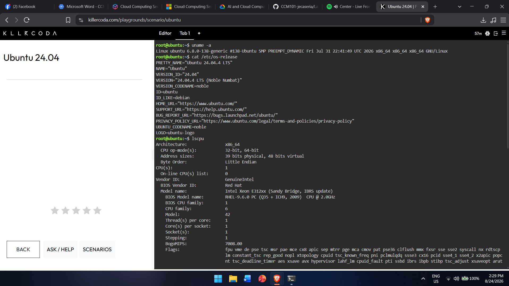
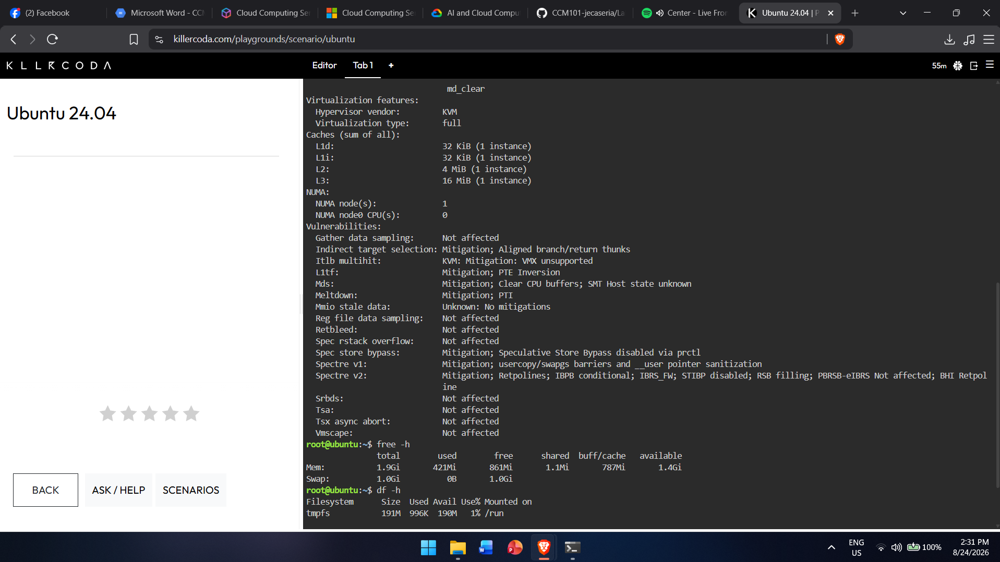
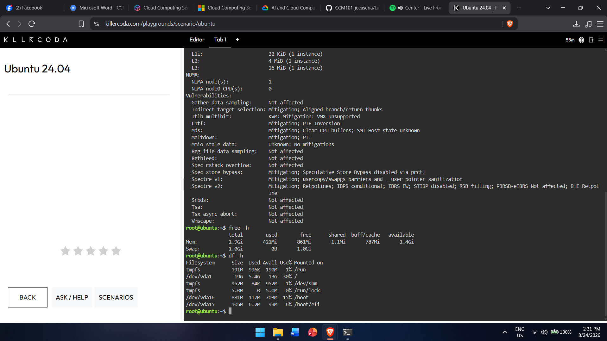

# Laboratory 03 – Multi-Cloud Explorer

## Checkpoint 7 – Linux Investigation

### Linux Commands and Results

Commands run in KillerCoda:

- `uname -a` / `cat /etc/os-release` → OS: Ubuntu 24.04.4 LTS (Noble Numbat)
- `lscpu` → CPU: Intel Xeon E312xx (Sandy Bridge) CPU @ 2.0GHz, 1 CPU, 1 core, 1 thread
- `free -h` → Memory: 1.9Gi total, 421Mi used, 861Mi free, 1.4Gi available
- `df -h` → Disk: 19G total, 5.4G used, 13G available

## Cloud Migration

### AWS

Amazon EC2 – virtual machines  
Amazon EBS – persistent storage

### Azure

Azure Virtual Machines – virtual machines  
Azure Managed Disks – persistent storage

### GCP

Google Compute Engine – virtual machines  
Google Persistent Disk – persistent storage

## Cloud Service Comparison

1. AWS – EC2 + EBS
2. Azure – Virtual Machines + Managed Disks
3. GCP – Compute Engine + Persistent Disk

## Conclusion

All three cloud providers can host the same Ubuntu Linux server using a compatible Linux image. They also provide additional cloud features such as scalability, backups, monitoring, and flexible resource management.
