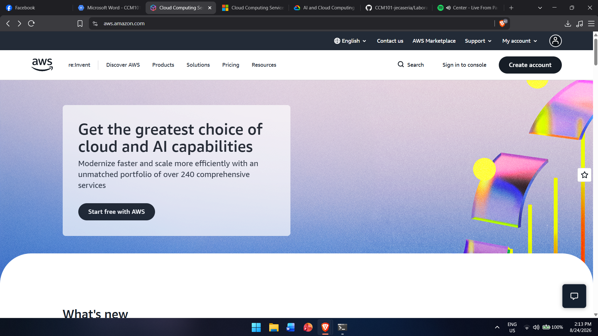

# AWS Research

## Brief Overview
AWS is Amazon's cloud computing platform, launched in 2006. It is the market leader and offers the broadest catalog of cloud services.

## Global Infrastructure
Organized into Regions (e.g. us-east-1) and Availability Zones within each region, plus Edge Locations for CloudFront content delivery.

## Cloud Management Console
AWS Management Console (web), AWS CLI, and AWS CloudShell.

## Four (4) Core Services
1. Amazon EC2 – virtual machines
2. Amazon S3 – object storage
3. Amazon RDS – managed relational databases
4. AWS Lambda – serverless compute

## Three (3) Advantages
1. Widest service catalog (200+ services)
2. Most mature ecosystem and community
3. Largest global infrastructure footprint

## Typical Enterprise Use Cases
- Scalable web/mobile app backends
- Big data analytics (S3 + Athena/Redshift)
- Disaster recovery
- ML training/deployment (SageMaker)

