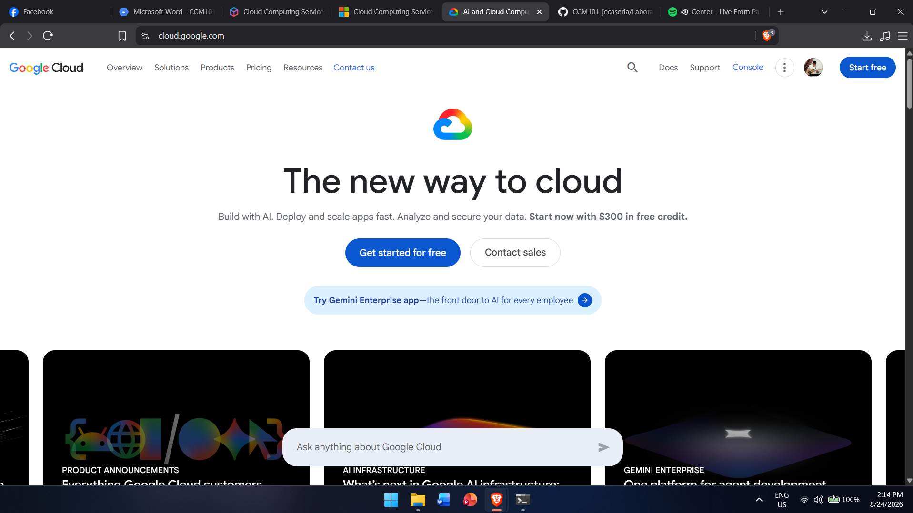

# Google Cloud Platform Research

## Brief Overview
GCP began with Google App Engine in 2008, expanding into the full platform around 2011. Runs on the same infrastructure as Google Search and YouTube. Known for AI/ML and Kubernetes leadership.

## Global Infrastructure
Regions and Zones connected by Google's private global fiber network; Cloud CDN for edge delivery.

## Cloud Management Console
Google Cloud Console (web), gcloud CLI, Cloud Shell.

## Four (4) Core Services
1. Compute Engine
2. Cloud Storage
3. Cloud IAM
4. Google Kubernetes Engine (GKE)

## Three (3) Advantages
1. Leading AI/ML tools (TensorFlow, Vertex AI)
2. Best managed Kubernetes (GKE) — Google created Kubernetes
3. Strong data analytics (BigQuery)

## Typical Enterprise Use Cases
- Big data analytics/BI (BigQuery)
- AI/ML model development
- Containerized microservices (Kubernetes)
- Real-time data pipelines (Pub/Sub, Dataflow)

