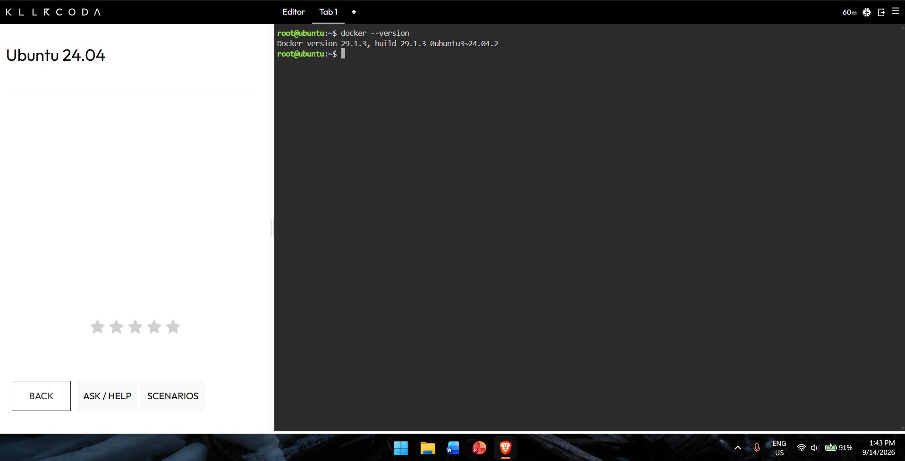
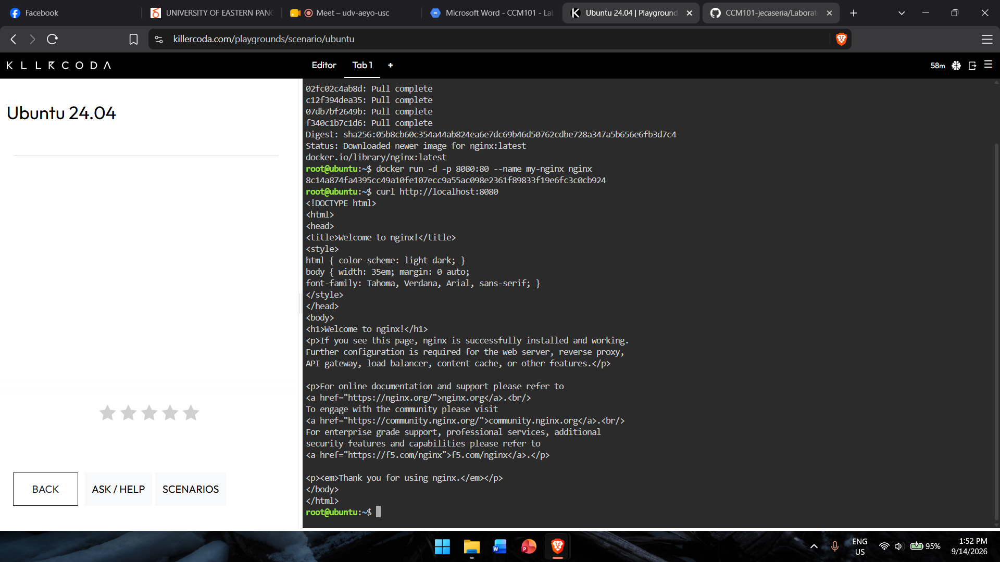
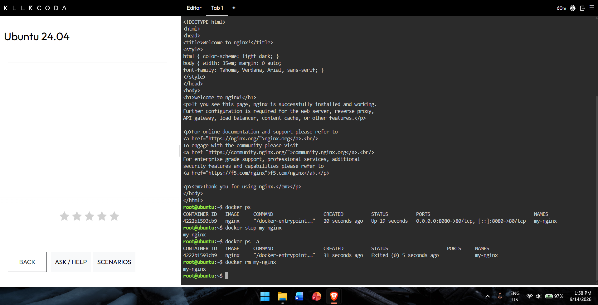

# Docker Deployment Log

This document records the exact Docker commands used to verify the environment, deploy an Nginx web server, and manage its full lifecycle — so the client's IT team can replicate the steps.

## Verifying Docker

docker --version
docker info

- `docker --version` — checks the installed Docker version.
- `docker info` — shows the current status of the Docker environment, including number of containers, images, and system resources.

## Deploying Nginx

docker pull nginx
docker run -d -p 8080:80 --name my-nginx nginx
curl http://localhost:8080

- `docker pull nginx` — downloads the official Nginx image from Docker Hub.
- `docker run -d -p 8080:80 --name my-nginx nginx` — runs Nginx as a container in detached (background) mode, mapping port 8080 on the host to port 80 inside the container, and names the container `my-nginx`.
- `curl http://localhost:8080` — sends an HTTP request to confirm the web server is running; returns the "Welcome to nginx!" HTML page.

## Container Lifecycle

docker ps
docker stop my-nginx
docker ps -a
docker rm my-nginx

- `docker ps` — lists all currently running containers.
- `docker stop my-nginx` — gracefully stops the running Nginx container.
- `docker ps -a` — lists all containers, including stopped ones, to verify `my-nginx` has stopped.
- `docker rm my-nginx` — permanently removes the stopped container from the system.

