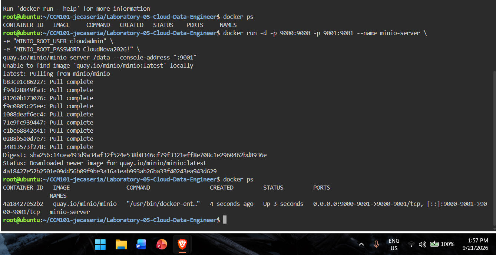
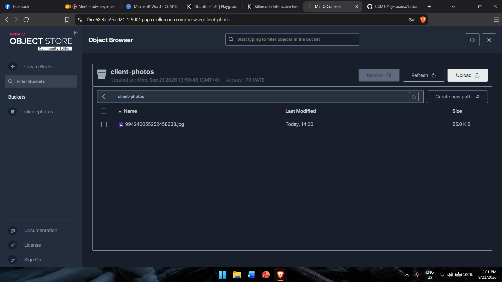

# MinIO Deployment Documentation

Note: The image was pulled from quay.io/minio/minio instead of Docker Hub, because Docker Hub returned a pull access error (likely a temporary rate limit on the shared KillerCoda network).

## Web Console Port
Port **9001** is used to open the MinIO web console in the browser.

## Bucket Created
**client-photos** — created in the MinIO web console, and a test file was uploaded to it.

## What the -e Flags Do
- `MINIO_ROOT_USER`: sets the login username for the MinIO server.
- `MINIO_ROOT_PASSWORD`: sets the login password for the MinIO server.

These flags let us set the username and password when the container starts, instead of writing them directly into the MinIO program.

## Screenshots

### MinIO Server Running

### Bucket Created and File Uploaded

## Docker Command Used
docker run -d -p 9000:9000 -p 9001:9001 --name minio-server
-e "MINIO_ROOT_USER=cloudadmin"
-e "MINIO_ROOT_PASSWORD=CloudNova2026!"
quay.io/minio/minio server /data --console-address ":9001"
