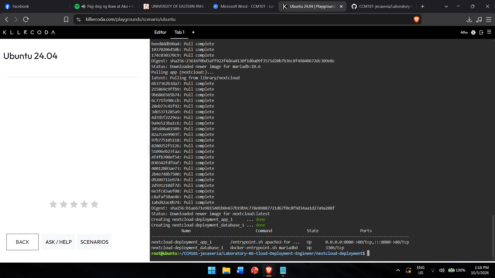

# Laboratory 6 – Cloud Deployment Engineer

## Mission Overview
Deployed a two-tier private cloud storage system (Nextcloud + MariaDB) using
Docker Compose and Infrastructure as Code.

## Objectives
- Explain multi-tier architecture
- Understand the structure of docker-compose.yml
- Use nano to create configuration files
- Deploy a multi-container application with Docker Compose
- Document IaC principles using Markdown

## Commands Executed
```bash
mkdir nextcloud-deployment
cd nextcloud-deployment
nano docker-compose.yml
docker-compose up -d
docker-compose ps
docker-compose down
```

## Skills Learned
- Writing YAML configuration files
- Using the nano text editor
- Deploying and tearing down multi-container stacks
- Accessing containerized apps through port mapping
- Documenting work in Markdown

## Screenshots

